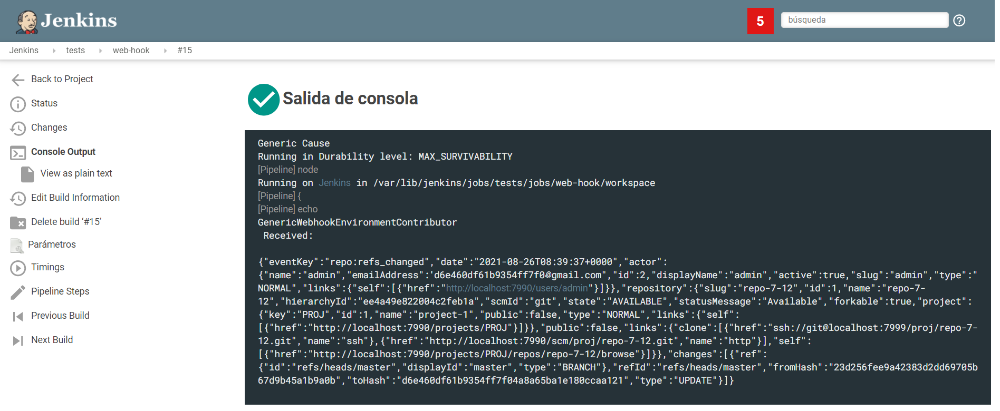

# Webhook de Bitbucket a Jenkins

## 1. Configurar Jenkins

### 1.1 Instalar plugin

El plugin que se va a utilizar es [Generic Webhook Trigger Plugin](https://github.com/jenkinsci/generic-webhook-trigger-plugin). Para realizar la instalación del mismo, se puede realizar mediante el UI de Jenkins o también se puede utilizar ```install-plugins.sh``` especificando **generic-webhook-trigger:1.75**




### 1.2 Configurar plugin en pipeline

Para configurar el plugin, tenemos dos opciones:
* Configuración manual
* Usar el plugin JobDSL

#### 1.2.1 Configurar plugin en pipeline manualmente
Para configurar manualmente, hay que abrir la configuración de la pipeline y activar la opción **Generic Webhook Trigger**. Una vez activada, podemos configurar los campos de la forma que más nos convenga. 

#### 1.2.2 Configurar plugin en pipeline mediante JobDSL
Para automatizar el proceso de instalación, es posible usar el plugin de JobDSL. Se puede usar de la siguiente manera:

```
pipelineJob('Generic Job Example') {

 triggers {
  genericTrigger {
   genericVariables {
    genericVariable {
     key("VARIABLE_FROM_POST")
     value("\$.something")
     expressionType("JSONPath") //Optional, defaults to JSONPath
     regexpFilter("") //Optional, defaults to empty string
     defaultValue("") //Optional, defaults to empty string
    }
   }
   genericRequestVariables {
    genericRequestVariable {
     key("requestParameterName")
     regexpFilter("")
    }
   }
   genericHeaderVariables {
    genericHeaderVariable {
     key("requestHeaderName")
     regexpFilter("")
    }
   }
   token('abc123')
   tokenCredentialId('')
   printContributedVariables(true)
   printPostContent(true)
   silentResponse(false)
   regexpFilterText("\$VARIABLE_FROM_POST")
   regexpFilterExpression("aRegExp")
  }
 }

 definition {
  cps {
   // Or just refer to a Jenkinsfile containing the pipeline
   script('''
    node {
     stage('Some Stage') {
      println "Hello world"
     }
    }
   ''')
   sandbox()
  }
 }
}
```


## 2. Configurar Bitbucket

En versiones actuales de Bitbucket, la opción de Webhook ya viene instalada por defecto. Para configurar un repositorio para que utilice el webhook, disponemos de dos opciones:
* Configurar manualmente
* Utilizar API de BITBUCKET

#### 2.1 Configurar webhook manualmente

Hay que acceder al repositorio e ir a ```Settings > Webhooks > Create webhook``` y seleccionar los parámetros deseado.


#### 2.1 Configurar webhook mediante API

Para configurar un webhook mediante la API de Bitbucket, hay que realizar el siguiente POST:
```
curl -X POST -u credentials -H 'Content-Type: application/json'
  https://api.bitbucket.org/2.0/repositories/my-workspace/my-repo-slug/hooks
  -d '
    {
      "description": "Webhook Description",
      "url": "https://example.com/",
      "active": true,
      "events": [
        "repo:push",
        "issue:created",
        "issue:updated"
      ]
    }'
```

Para más información sobre la configuración mediante API ver [aquí](https://developer.atlassian.com/bitbucket/api/2/reference/resource/repositories/%7Bworkspace%7D/%7Brepo_slug%7D/hooks#post)

## 3. Ejecución del hook

Una vez que se realiza cualquier cambio indicado en la configuración del webhook, podremos ver en Jenkins la ejecución de la pipeline y la información del cambio realizado:

